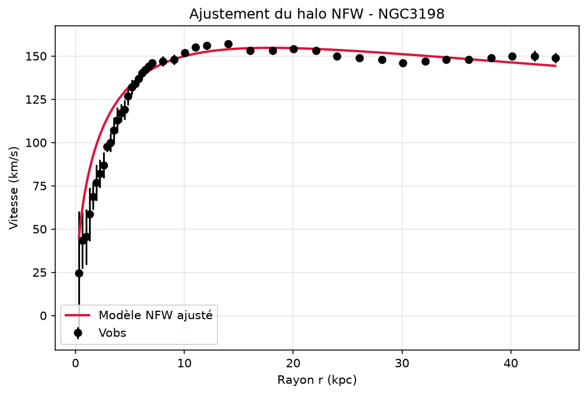
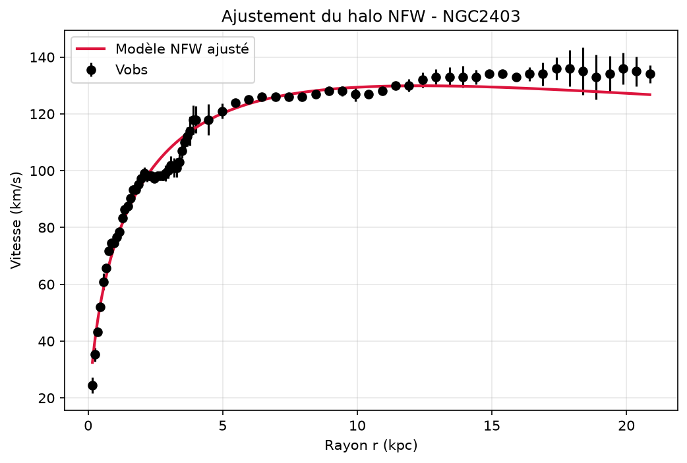

# Dark Matter Data Analysis

Modélisation d'un halo de matière noire (profil NFW) et confrontation à de vraies courbes de rotation de galaxies (base SPARC).

## Contexte

Dans une galaxie, si toute la masse était concentrée dans les étoiles visibles, les régions éloignées du centre devraient tourner nettement plus lentement que les régions centrales — comme Neptune tourne plus lentement que Mercure autour du Soleil. Ce n'est pas ce qu'on observe : la vitesse de rotation reste quasiment constante loin du centre. Cet écart entre prédiction et réalité est l'une des preuves historiques de la matière noire (Vera Rubin, années 1970).

Ce projet modélise un halo de matière noire, en dérive une courbe de rotation théorique, et l'ajuste à des mesures réelles.

## Méthode

1. **Densité** — profil NFW : ρ(r) = ρ₀ / [(r/r_s)(1 + r/r_s)²]
2. **Masse enclose** — intégrale analytique : M(r) = 4πρ₀r_s³ [ln(1+x) − x/(1+x)], avec x = r/r_s
3. **Vitesse circulaire** — v_c(r) = √(G·M(r)/r)
4. **Ajustement** — `scipy.optimize.curve_fit` trouve (ρ₀, r_s) qui collent le mieux à Vobs, pondéré par l'incertitude de mesure (`errV`)

## Résultats

| Galaxie | ρ₀ (M☉/kpc³) | r_s (kpc) | χ² réduit |
|---|---|---|---|
| NGC 3198 | 3.01×10⁷ ± 0.10×10⁷ | 8.3 ± 0.1 | 3.54 |
| NGC 2403 | 4.43×10⁷ ± 0.07×10⁷ | 5.7 ± 0.1 | 8.34 |




## Limite connue

Le modèle est ajusté directement sur `Vobs`, comme si toute la vitesse venait du halo. En réalité, le gaz et les étoiles visibles (`Vgas`, `Vdisk`, `Vbul`, présents dans les données SPARC) contribuent aussi. Les deux ajustements le confirment : χ² réduit de 3.54 (NGC 3198) et 8.34 (NGC 2403), loin de 1 dans les deux cas — un écart systématique, pas seulement du bruit de mesure. Prochaine étape : soustraire cette contribution baryonique avant d'ajuster le halo seul.

## Utilisation

```
pip install numpy matplotlib pandas scipy
python profil_nfw.py
```

## Données

Courbes de rotation individuelles depuis [SPARC](https://astroweb.case.edu/SPARC/) (Lelli, McGaugh & Schombert 2016, 175 galaxies) : télécharger `Rotmod_LTG.zip`, placer le `<Galaxie>_rotmod.dat` voulu à la racine du projet.
